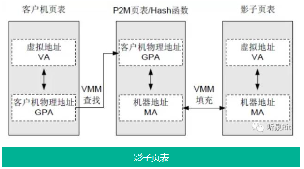

# date()
# false()
# 01 虚拟化概念()

<!--more-->


## 1. 虚拟化架构类型()

### 全虚拟架构

### 操作系统层虚拟化架构


> - 依靠对 Guest OS 的修改实现，Virtualization Layer 提供给 Guest OS 的调用接口，使虚拟机可以直接调用底层硬件，代表技术为 Xen
>
> **注:**  虚拟机系统内核要求与宿主机保持一致，**e.g.** Host OS 为 Ubuntu, Host OS(1) 可以为 Ubuntu 或 Cent OS


### **平台(硬件)虚拟化架构**


> - 借助硬件平台（主要是指 CPU）的支持来提供高效的全虚拟化
> - Guest OS 和 VMM 的执行环境被隔离开，Guest OS 有了自己的“全套寄存器”，可以直接运行在最高级别
> - Guest OS 需要执行特权指令，直接从自己的“寄存器”中获取执行指令即可
>
> **注:** 主要用于服务器，代表技术为 KVM


## 2. 内存虚拟化

### 内存全虚拟化



> - Guest OS 相当于物理机上的应用，创建时分配了固定长度的内存，即 GPA
> - Guest OS 上的应用程序跑在连续的虚拟内存上，虚拟内存由 MMU 单元负责映射到 GPA 上
> - GPA 本身也是 Guest OS 的虚拟内存，需要通过 VMM 映射到物理机内存 MA
> - **影子页表** ： 直接记录下 VA 与 MA 的映射关系，让两层映射降为一层


### 内存半虚拟化技术

- Guest OS 中的 MMU 自身不具备写内存页表的权限，而是把写权限交给 VMM 来维护
- 当 Guest OS 需要更新或添加页表映射关系时，把写请求交给 VMM 
- VMM 检查写请求，并通过查找自身所维护的关系表，将写请求中的物理地址替换为真正的物理地址
- 最后再把修改过的映射关系（即 VA –> MA）页表载入到虚拟机的 MMU 中
- 这样虚拟机通过 MMU 中维护的页表对应关系就可以直接访问到底层的硬件资源


### 内存硬件辅助虚拟化

- 内存硬件辅助虚拟化其实是影子页表的替代者，因为它把影子页表中依靠软件实现的改为硬件实现，所以性能几乎接近裸机
- **EPT技术** ：硬件处理客户机物理地址与机器地址的映射关系
- **TLB技术** ：转换寻址缓冲区，帮助缓存CPU中的MMU进行地址转换的结果，方便下次相同线性地址直接通过 TLB 中的缓存结果而得到物理地址，省去了查表的过程
- **VPID技术** ：虚拟处理器标识，在硬件上为每个TLB项增加一个标识，从而能够区分开不同虚拟处理器的 TLB 

```shell
# 查看服务器上 CPU 对 ETP 与 VPID 的支持情况
$ grep -o 'ept vpid'  /proc/cpuinfo 
ept vpid                              # 有显示，即为支持
ept vpid

# 在 KVM 中，修改内核参数来调整打开或者关闭 EPT & VPID
# 加载 KVM 模块
$ modprobe kvm_intel                  # X86 架构
$ modprobe kvm_amd                    # amd 架构

# 检查
$ modinfo kvm_intel

# EPT 配置文件
$ cat /sys/module/kvm_intel/parameters/ept
Y

# VPID 配置文件
$ cat /sys/module/kvm_intel/parameters/vpid 
Y
```

